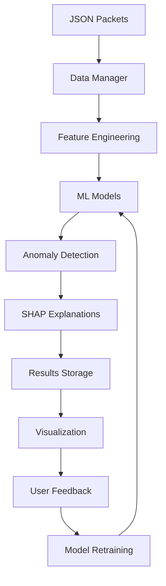

# 📁 NDR Platform v2.1.0 - Project Organization & Architecture

> **Last Updated:** August 2025 | **Status:** Production Ready

---

## 🏗️ **Enhanced Architecture Overview**

The NDR Platform follows a modular, enterprise-grade architecture designed for scalability, maintainability, and high performance. The structure has been optimized following recent critical fixes and enhancements.

### **🎯 Design Principles**
- **Configuration-Driven:** All paths and settings managed via YAML
- **Modular Components:** Clear separation of concerns
- **Enterprise-Ready:** Robust error handling and logging
- **ML-First:** Built around machine learning workflows
- **Real-time Capable:** Live monitoring and processing

---

## � **Directory Structure** *(Post-Enhancement)*

```
� NDR Platform v2.1.0/
├── 🎮 app/                          # Streamlit Web Interface
│   ├── 📁 components/               # Reusable UI Components
│   │   ├── 📄 error_handler.py      # Enhanced error handling
│   │   ├── 📄 visualization.py      # Data visualization (Arrow-compatible)
│   │   ├── 📄 data_source_selector.py # Data source management
│   │   ├── 📄 explainers.py         # ML explanation components
│   │   ├── 📄 file_utils.py         # File operations utilities
│   │   ├── 📄 model_comparison.py   # Model performance comparison
│   │   ├── 📄 report_generator.py   # Professional reporting
│   │   └── 📄 search_filter.py      # Advanced search capabilities
│   ├── 📁 pages/                    # Application Pages (Fixed & Enhanced)
│   │   ├── 📄 anomaly_detection.py  # ✅ Fixed: Results saving integration
│   │   ├── 📄 explain_feedback.py   # ✅ Fixed: NaN handling & Arrow compatibility
│   │   ├── 📄 auto_labeling.py      # AI-powered classification
│   │   ├── 📄 analytics_dashboard.py # Comprehensive analytics
│   │   ├── 📄 real_time_monitoring.py # Live network monitoring
│   │   ├── 📄 mitre_mapping.py      # Threat intelligence mapping
│   │   ├── 📄 model_management.py   # ML model lifecycle
│   │   ├── 📄 model_comparison.py   # Performance benchmarking
│   │   ├── 📄 reporting.py          # Report generation
│   │   └── 📄 file_diagnostics.py   # System health monitoring
│   ├── 📁 state/                    # Session Management
│   │   └── 📄 session_state.py      # Streamlit state handling
│   ├── 📄 main.py                   # Application entry point
│   ├── 📄 about.py                  # Platform information
│   └── 📄 settings.py               # User preferences

├── 🧠 core/                         # ML Engine & Backend Logic
│   ├── � explainers/               # Model Explainability (Enhanced)
│   │   ├── 📄 shap_explainer.py     # ✅ Fixed: Comprehensive NaN handling
│   │   ├── 📄 lime_explainer.py     # LIME-based explanations
│   │   ├── 📄 explainer_factory.py  # Factory pattern implementation
│   │   └── 📄 base_explainer.py     # Abstract base class
│   ├── 📁 models/                   # ML Model Implementations
│   │   ├── 📄 ensemble.py           # ✅ Fixed: Proper model instantiation
│   │   ├── 📄 isolation_forest.py   # Anomaly detection model
│   │   ├── 📄 local_outlier_factor.py # LOF implementation
│   │   ├── 📄 one_class_svm.py      # SVM-based detection
│   │   ├── � knn.py                # K-Nearest Neighbors
│   │   ├── 📄 hdbscan_detector.py   # Hierarchical clustering
│   │   └── � base_model.py         # Model interface
│   ├── � model_manager.py          # ✅ Fixed: Results saving with anomaly_indices
│   ├── 📄 data_manager.py           # Data processing pipeline
│   ├── 📄 config_loader.py          # Configuration management
│   ├── 📄 feedback_manager.py       # User feedback system
│   ├── 📄 anomaly_tracker.py        # Persistent anomaly tracking
│   ├── 📄 security_intelligence.py  # Threat intelligence
│   ├── 📄 mitre_mapper.py           # MITRE ATT&CK integration
│   ├── 📄 predictive_security.py    # Forecasting capabilities
│   ├── � notification_service.py   # Alert management
│   ├── 📄 logging_config.py         # Centralized logging
│   └── 📄 session_manager.py        # Session handling

├── ⚙️ config/                       # Configuration Files
│   ├── 📄 config.yaml               # ✅ Main configuration (paths corrected)
│   └── 📄 mitre_attack_data.json    # MITRE framework data

├── � data/                         # ✅ Fixed: Proper directory structure
│   ├── 📁 json/                     # Source JSON packet data
│   ├── � results/                  # ✅ ML analysis results (config-driven)
│   ├── � feedback/                 # ✅ User feedback (config-driven)
│   ├── � reports/                  # Generated reports
│   ├── � anomaly_history/          # Historical tracking data
│   └── � examples/                 # Sample datasets

├── 🤖 models/                       # Trained ML Models
│   ├── 📄 IsolationForest_model.pkl # Serialized models
│   ├── 📄 *_model_metadata.json     # Model metadata
│   └── � backups/                  # Model version backups

├── 📚 guides/                       # Documentation Suite
│   ├── 📄 PROJECT_ORGANIZATION.md   # This document
│   ├── 📄 USER_GUIDE.md             # User workflows
│   ├── 📄 CONFIGURATION_GUIDE.md    # Setup instructions
│   ├── 📄 DEPLOYMENT_GUIDE.md       # Production deployment
│   ├── 📄 API_DOCUMENTATION.md      # API reference
│   ├── 📄 LOGGING_GUIDE.md          # Logging configuration
│   └── 📄 SCRIPT_ORGANIZATION.md    # Utility scripts

├── �️ scripts/                      # Management Utilities
│   ├── 📄 model_manager.py          # Model operations
│   ├── 📄 data_manager.py           # Data operations
│   ├── 📄 health_check.py           # System monitoring
│   ├── 📄 backup.py                 # Backup utilities
│   ├── 📄 security_scanner.py       # Security validation
│   └── � deployment/               # Deployment scripts

├── 📝 logs/                         # Application Logs
│   ├── 📄 app.log                   # Main application logs
│   ├── 📄 anomaly_detection.log     # ML detection logs
│   ├── 📄 model_manager.log         # Model operation logs
│   └── 📄 errors.log                # Error tracking

├── ⚡ cache/                        # Temporary Cache
├── 🧪 tests/                        # Test Suite
│   ├── 📄 test_nan_arrow_fixes.py   # ✅ NaN & Arrow compatibility tests
│   ├── 📄 test_feedback_dirs.py     # ✅ Directory structure tests
│   ├── 📄 test_final_verification.py # ✅ Comprehensive verification
│   └── 📄 test_fixes.py             # General fix validation

├── 📄 run.py                        # ✅ Fixed: Config-driven directory creation
├── 📄 requirements.txt              # Python dependencies
├── 📄 README.md                     # ✅ Updated: Platform overview
├── 📄 FIX_SUMMARY.md                # ✅ Recent fixes documentation
└── 📄 LICENSE                       # License information
```

---

## 🔧 **Recent Critical Fixes Applied**

### **✅ Configuration Management**
- **Directory Creation:** `run.py` now uses `config.yaml` for all paths
- **Feedback Storage:** Correctly stored in `data/feedback` per configuration
- **Results Saving:** All outputs respect configured directory paths

### **✅ Data Processing Enhancements**
- **NaN Handling:** Port values display "N/A" instead of "nan"
- **Arrow Compatibility:** All dataframes cleaned for Streamlit display
- **SHAP Explainer:** Comprehensive error handling for missing values
- **Model Integration:** Seamless ensemble model creation and execution

### **✅ Error Resolution**
- **Results Saving:** Fixed missing `anomaly_indices` key in ModelManager
- **UnboundLocalError:** Resolved duplicate variable assignments
- **Encoding Issues:** Documented and provided fixes for Unicode corruption

---

## 🏛️ **Architecture Components**

### **🎮 Frontend Layer (app/)**
- **Streamlit Interface:** Modern, responsive web UI
- **Component Library:** Reusable widgets and visualizations
- **Page Routing:** Modular page structure with state management
- **Error Handling:** Graceful error display and recovery

### **🧠 Backend Engine (core/)**
- **ML Pipeline:** Multi-algorithm anomaly detection
- **Data Processing:** Robust ETL with validation
- **Configuration:** YAML-driven settings management
- **Intelligence:** MITRE mapping and threat analysis

### **📊 Data Layer (data/)**
- **Source Data:** JSON packet processing
- **Results Storage:** ML outputs and analysis
- **Historical Tracking:** Persistent anomaly records
- **User Feedback:** Learning system integration

### **🤖 Model Layer (models/)**
- **Trained Models:** Serialized ML algorithms
- **Metadata:** Model performance and configuration
- **Version Control:** Model backup and rollback

---

## � **Data Flow Architecture**



### **� Processing Pipeline**
1. **Data Ingestion:** JSON packet parsing and validation
2. **Feature Extraction:** Network metrics and patterns
3. **ML Analysis:** Multi-model anomaly detection
4. **Explanation Generation:** SHAP-based interpretability
5. **Results Storage:** Configured output persistence
6. **Visualization:** Interactive dashboard rendering
7. **Feedback Collection:** User validation and learning
8. **Model Evolution:** Continuous improvement cycle

---

## 🎯 **Component Responsibilities**

### **🎮 User Interface Components**
| Component | Purpose | Status |
|-----------|---------|--------|
| `anomaly_detection.py` | ML model training & analysis | ✅ Fixed |
| `explain_feedback.py` | Model interpretability | ✅ Enhanced |
| `analytics_dashboard.py` | Performance metrics | ✅ Stable |
| `real_time_monitoring.py` | Live network monitoring | ✅ Active |

### **🧠 Backend Components**
| Component | Purpose | Status |
|-----------|---------|--------|
| `model_manager.py` | ML lifecycle management | ✅ Fixed |
| `data_manager.py` | Data processing pipeline | ✅ Stable |
| `anomaly_tracker.py` | Historical tracking | ✅ Enhanced |
| `config_loader.py` | Configuration management | ✅ Robust |

### **🔧 Utility Components**
| Component | Purpose | Status |
|-----------|---------|--------|
| `run.py` | Application launcher | ✅ Fixed |
| `feedback_manager.py` | User feedback system | ✅ Stable |
| `logging_config.py` | Centralized logging | ✅ Active |
| `session_manager.py` | State management | ✅ Stable |

---

## 📊 **Configuration Management**

### **� Central Configuration**
All system paths and settings are managed through `config/config.yaml`:

```yaml
system:
  data_dir: "data"
  results_dir: "data/results"
  models_dir: "models"
  
feedback:
  storage_dir: "data/feedback"
  
anomaly_detection:
  models:
    ensemble:
      enabled: true
```

### **🔄 Environment Adaptation**
- **Development:** Local file system paths
- **Production:** Scalable storage configuration
- **Testing:** Isolated data environments
- **Docker:** Container-aware path mapping

---

This architecture ensures scalability, maintainability, and robust operation of the NDR Platform across all deployment scenarios.
│   ├── 📁 reports/                 # 🔧 Generated reports (moved from /reports/)
│   └── 📁 results/                 # 🔧 Analysis results (moved from /results/)
├── 📁 guides/                      # 📚 Documentation & Deployment
│   ├── 📁 deployment/              # 🐳 Docker & deployment configs
│   │   ├── 📄 docker-compose.yml   # Docker compose configuration
│   │   ├── 📄 Dockerfile           # Docker image configuration
│   │   ├── 📄 nginx.conf           # Nginx reverse proxy config
│   │   └── 📄 README.md            # Deployment instructions
│   ├── 📄 API_DOCUMENTATION.md     # API reference documentation
│   ├── 📄 CONFIGURATION_GUIDE.md   # Configuration setup guide
│   ├── 📄 DEPLOYMENT_GUIDE.md      # Deployment instructions
│   ├── 📄 LOGGING_GUIDE.md         # Logging configuration guide
│   ├── 📄 PROJECT_ORGANIZATION.md  # 📁 This document
│   ├── 📄 README.md                # Documentation index
│   ├── 📄 SCRIPT_ORGANIZATION.md   # Scripts documentation
│   └── 📄 USER_GUIDE.md            # User manual
├── 📁 logs/                        # 📝 Application Logs
│   ├── 📄 anomaly_detection.log    # Anomaly detection logs
│   ├── 📄 app.log                  # Main application logs
│   ├── 📄 data_manager.log         # Data management logs
│   ├── 📄 data_processing.log      # Data processing logs
│   ├── 📄 errors.log               # Error logs
│   ├── 📄 model_manager.log        # ML model logs
│   ├── 📄 models.log               # Model training logs
│   ├── 📄 streamlit_app.log        # Streamlit application logs
│   └── 📄 visualization.log        # Visualization logs
├── 📁 models/                      # 🤖 Trained ML Models
│   ├── 📁 backups/                 # Model backups
│   ├── 📄 IsolationForest_model.pkl # Trained Isolation Forest model
│   └── 📄 IsolationForest_model_metadata.json # Model metadata
├── 📁 scripts/                     # 🛠️ Management & Utility Scripts
│   ├── 📁 linux/                   # Linux-specific scripts
│   ├── 📁 windows/                 # Windows-specific scripts
│   ├── 📄 backup.py                # Data backup utilities
│   ├── 📄 data_manager.py          # Data management CLI
│   ├── 📄 dev_utils.py             # Development utilities
│   ├── 📄 health_check.py          # System health monitoring
│   ├── 📄 log_analyzer.py          # Log analysis tools
│   ├── 📄 migrate_anomaly_storage.py # 🆕 Anomaly storage migration
│   ├── 📄 model_manager.py         # Model management CLI
│   ├── 📄 README.md                # Scripts documentation
│   ├── 📄 security_scanner.py      # Security vulnerability scanner
│   └── 📄 verify_structure.py      # Project structure verification
├── 📁 tests/                       # 🧪 Test Suite
│   ├── 📄 README.md                # Test documentation
│   ├── 📄 test_fixes.py            # Bug fix tests
│   └── 📄 test_logging.py          # Logging system tests
│
├── 📄 LICENSE                      # Project license
├── 📄 README.md                    # 🔄 Main project documentation
├── 📄 requirements.txt             # Python dependencies
└── 📄 run.py                       # 🚀 Application entry point
```

### 📊 **Optimization Results:**
- **🗂️ Reduced**: 16 → 11 top-level directories (-31% reduction)
- **📁 Consolidated**: All data storage under `data/` with logical separation
- **🎯 Isolated**: JSON data in `data/json/` to prevent upload conflicts
- **📚 Organized**: Documentation and deployment in unified `guides/` directory
- **🧹 Cleaned**: Removed Python cache directories and duplicate docs
- **🔧 Cleaner**: No redundant/empty directories
- **📈 Maintainable**: Clear separation of concerns with improved organization
- **🚀 Enterprise-Ready**: Professional structure following best practices

## 🚀 **Major Recent Enhancements** *(August 2025)*

### ✨ **Enhanced Anomaly Tracking System**
- **📊 AnomalyTracker** (`core/anomaly_tracker.py`) - Enterprise-grade anomaly lifecycle management (364 lines)
- **📈 Persistent Storage** - JSON-based historical tracking with backup capabilities
- **🎯 Baseline Learning** - Automatic pattern learning and deviation detection
- **📋 Severity Classification** - Automated risk assessment (low/medium/high/critical)
- **⚡ Real-time Integration** - Seamless tracking of all ML anomaly detections

### 🔒 **Critical Storage Migration** *(August 6, 2025)*
- **🚨 STORAGE MOVED**: Anomaly history relocated from `cache/anomalies/` to `data/anomaly_history/`
- **🔧 REASON**: Cache directories are temporary and clearable - anomaly history is **critical persistent data**
- **✅ MIGRATION**: Automatic migration script created (`scripts/migrate_anomaly_storage.py`)
- **⚠️ PROTECTION**: `data/anomaly_history/` is **never clearable** - contains enterprise security records
- **🔧 CONFIGURABLE**: Storage location now configurable via `config/config.yaml` → `anomaly_storage.history_dir`

### 🤖 **Advanced ML Configuration System**
- **🔧 Configurable Models** - Choose from 6 ML algorithms via config.yaml
- **⚖️ Ensemble Detection** - Weighted ensemble combinations for improved accuracy
- **🎛️ Dynamic Thresholds** - Environment-specific confidence levels
- **📊 Model Performance** - Detailed analysis and comparison tools

### 📊 **Dashboard Enhancements**
- **📈 Anomaly History Tab** - Time-filtered historical analysis with trend insights
- **🎯 Detailed Tracking** - Every detection stored with full forensic context
- **⚡ Quick Actions** - Acknowledge, export, and analyze anomalies
- **📊 Baseline Status** - Real-time deviation monitoring from learned patterns

## 🎯 **Core Application Components**

### 1. **Real-time Network Monitoring** (`app/pages/real_time_monitoring.py`)
- **Purpose**: Enhanced real-time network monitoring dashboard with ML anomaly detection
- **Features**: 
  - 📊 **Anomaly History Dashboard** - Time-filtered historical analysis
  - 🤖 **Configurable ML Models** - 6 algorithms via YAML configuration
  - 📈 **Baseline Learning** - Automatic pattern detection and deviation alerts
  - ⚡ **Real-time Tracking** - Persistent anomaly storage and acknowledgment
  - 🎯 **Severity Classification** - Automated risk assessment levels
- **Data Source**: Arkime JSON packet captures from `config.yaml`
- **Metrics**: Packet counts, IP analysis, protocol distribution, bytes transferred
- **Size**: 1,775 lines of code
- **Status**: ✅ **Enhanced & Optimized** *(August 2025)*

### 2. **Enterprise Anomaly Tracking** (`core/anomaly_tracker.py`)
- **Purpose**: Complete anomaly lifecycle management and historical analysis
- **Features**:
  - 📊 **Persistent Storage** - JSON-based anomaly records with backup
  - 📈 **Baseline Learning** - System learns normal patterns automatically
  - 🎯 **Severity Classification** - Automated risk assessment (low/medium/high/critical)
  - 📋 **Historical Analysis** - Time-based trending and pattern recognition
  - ⚡ **Acknowledgment Workflow** - Mark anomalies as reviewed with notes
- **Size**: 364 lines of code
- **Status**: ✅ **Newly Added & Active** *(August 2025)*

### 3. **ML Model Implementations** (`core/models/`)
- **Purpose**: Machine learning algorithm implementations for anomaly detection
- **Available Models**:
  - 🌳 **Isolation Forest** (`isolation_forest.py`) - Tree-based anomaly detection
  - 📍 **Local Outlier Factor** (`local_outlier_factor.py`) - Density-based outlier detection
  - 🎯 **One-Class SVM** (`one_class_svm.py`) - Support vector machine for outliers
  - 👥 **K-Nearest Neighbors** (`knn.py`) - Distance-based anomaly detection
  - 🔗 **DBSCAN/HDBSCAN** (`dbscan.py`, `hdbscan.py`) - Clustering-based detection
  - 🎭 **Ensemble** (`ensemble.py`) - Multiple model combinations
- **Base Class**: `base_model.py` - Abstract base class for all models
- **Status**: ✅ **Fully Implemented & Configurable**

### 4. **Predictive Security Engine** (`core/predictive_security.py`)
- **Purpose**: Threat probability forecasting and risk assessment
- **Features**: 24-hour threat predictions, attack progression modeling
- **Integration**: Works with anomaly tracker for enhanced threat intelligence
- **Status**: ✅ **Active & Working**

### 5. **Configuration Management** (`config/config.yaml`)
- **Purpose**: Centralized configuration for all system components
- **Features**:
  - 🔧 **Model Selection** - Choose from 6 ML algorithms
  - ⚖️ **Ensemble Weights** - Configurable model combinations for improved accuracy
  - 🎛️ **Dynamic Thresholds** - Environment-specific confidence levels
  - 🔄 **Auto-refresh Settings** - Configurable monitoring intervals (30s to 30min)
  - 🗂️ **Directory Paths** - Configurable data source locations
- **Status**: ✅ **Enhanced & Configurable** *(August 2025)*

## 🔧 **Enhanced Configuration Integration**

### **Key Configuration Features**
- ✅ **Configurable ML Models** - Switch between 6 algorithms via YAML
- ✅ **Ensemble Weights** - Fine-tune model combinations for accuracy
- ✅ **Auto-refresh Control** - Adjust monitoring intervals (30s to 30min)
- ✅ **Confidence Thresholds** - Environment-specific anomaly sensitivity
- ✅ **Persistent Storage** - Configurable anomaly history location (`data/anomaly_history/`)
- ✅ **Non-hardcoded paths** - All data sources read from config.yaml
- 🔒 **Protected Data** - Critical anomaly history never stored in cache directories

## 📊 **Enhanced Data Flow Architecture**

```
📂 Arkime JSON Files (data/json/)
    ↓
🔧 config.yaml (Enhanced ML & Monitoring Config)
    ↓  
📡 Real-time File Monitoring (core/file_watcher.py)
    ↓
🤖 Configurable ML Processing (6 algorithms + ensemble)
    ↓
📊 AnomalyTracker (Persistent storage & baseline learning)
    ↓
📈 Enhanced Dashboard (Real-time + Historical Analysis)
    ↓
🔮 Predictive Analytics (core/predictive_security.py)
```

### **Enhanced Features Pipeline**
1. **📊 Data Ingestion** - Real-time Arkime JSON processing
2. **🤖 ML Analysis** - Configurable 6-algorithm anomaly detection  
3. **📈 Anomaly Tracking** - Persistent storage with baseline learning
4. **🎯 Severity Classification** - Automated risk assessment
5. **📋 Historical Analysis** - Time-based trending and pattern recognition
6. **⚡ Real-time Dashboard** - Live monitoring with acknowledgment workflow

This **enhanced architecture** provides **enterprise-grade anomaly tracking** with **comprehensive ML configuration** while maintaining **real-time capabilities** and **historical analysis** for **Arkime packet data**.
